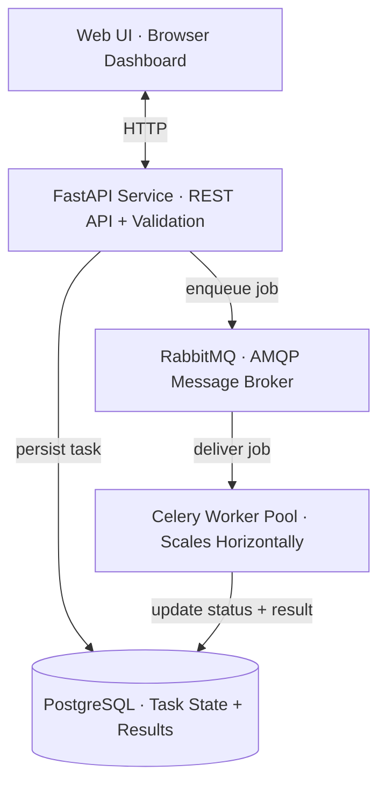

# Data Processing Web System

A Python-based web system that ingests JSON datasets, processes them asynchronously, and exposes results via a REST API and a browser dashboard. The architecture separates a lightweight HTTP layer (FastAPI) from a horizontally-scalable worker pool (Celery), coordinated by a durable message broker (RabbitMQ) with all task state persisted to PostgreSQL.

---

## Getting Started

### Prerequisites

- **Docker** and **Docker Compose** (v2) installed and running.

### 1. Clone the repository

```bash
git clone <repo-url>
cd GRATakehome
```

### 2. Create the environment files

The project uses two `.env` files with different roles:

**Root `.env`** (read by Docker Compose to interpolate variables in `docker-compose.yml` — controls the `db`, `rabbitmq`, and `pgadmin` containers):

```env
POSTGRES_USER=gra
POSTGRES_PASSWORD=gra_secret
POSTGRES_DB=gra_db

RABBITMQ_USER=gra
RABBITMQ_PASSWORD=gra_rabbit

PGADMIN_EMAIL=admin@example.com
PGADMIN_PASSWORD=admin
```

**`backend/.env`** (injected directly into the `api` and `worker` containers at runtime, read by pydantic-settings):

```env
POSTGRES_USER=gra
POSTGRES_PASSWORD=gra_secret
POSTGRES_DB=gra_db
POSTGRES_HOST=db
POSTGRES_PORT=5432

RABBITMQ_HOST=rabbitmq
RABBITMQ_PORT=5672
RABBITMQ_USER=gra
RABBITMQ_PASSWORD=gra_rabbit
```

The credentials in both files must match. `POSTGRES_HOST=db` and `RABBITMQ_HOST=rabbitmq` in `backend/.env` refer to the Docker Compose service names — keep these as-is for local development.

### 3. Start all services

```bash
docker compose up --build
```

This brings up six containers: **PostgreSQL**, **RabbitMQ**, **pgAdmin**, the **FastAPI** API server, two **Celery workers**, and an **Nginx**-served frontend. All service dependencies use healthchecks, so the API and workers won't start until Postgres and RabbitMQ are ready.

### 4. Access the application

| Service | URL |
|---|---|
| **Frontend (dashboard)** | [http://localhost:3000](http://localhost:3000) |
| **API (OpenAPI docs)** | [http://localhost:8000/docs](http://localhost:8000/docs) |
| **RabbitMQ management UI** | [http://localhost:15672](http://localhost:15672) (gra / gra_rabbit) |
| **pgAdmin** | [http://localhost:5050](http://localhost:5050) (admin@example.com / admin) |

### 5. Try it out

Upload one of the sample datasets through the dashboard or via curl:

```bash
curl -X POST http://localhost:8000/api/tasks \
  -F "file=@frontend/sample_dataset.json"
```

The response returns a `task_id` with status `NOT_STARTED`. Poll `GET /api/tasks/{task_id}` or watch the dashboard — the task will move through `IN_PROGRESS` → `COMPLETED` in ~15 seconds.

### 6. Running tests

The test suite covers data processing edge cases and API validation. With the services running:

```bash
docker compose exec api pytest tests/ -v
```

- **`test_processor.py`** — Unit tests for the pure `compute_summary` function: happy path, all-invalid records, empty records, missing fields, non-numeric values, bad timestamps, and mixed valid/invalid datasets.
- **`test_upload.py`** — API integration tests for `POST /api/tasks`: valid uploads, sequential multi-upload with distinct task IDs, invalid JSON, missing `dataset_id`, missing `records`, empty files, non-JSON content, and no file attached.

Celery is mocked during tests so no broker is needed; the DB session rolls back after each test for isolation.

---

## Architecture



A request flows like this:

1. The **browser** POSTs a JSON file to the API.
2. **FastAPI** validates the payload with Pydantic, persists a task row to Postgres, stores the raw dataset, and publishes a message to RabbitMQ. Returns **202 Accepted** in < 100 ms.
3. **RabbitMQ** durably holds the message until a worker is free.
4. A **Celery worker** picks up the message, marks the task `IN_PROGRESS`, processes the dataset (~15 s simulated), writes the result, and marks the task `COMPLETED`.
5. The **browser** polls the task endpoint every 2 seconds and renders the result once complete.

---

## Design Choices

### Technology Selection

| Technology | Why |
|---|---|
| **FastAPI** | Native async support, automatic OpenAPI spec generation, and first-class Pydantic integration for request validation. Endpoints return in milliseconds because they never perform processing — they only validate, persist, and enqueue. |
| **Celery** | Broker-agnostic (RabbitMQ today, SQS tomorrow with a one-line config change), mature retry/backoff/failure handling, and widely used in Python backend infrastructure. |
| **RabbitMQ** | Purpose-built AMQP broker with durable queues by default. Messages survive broker restarts. The built-in management UI (port 15672) makes queue depth and consumer status visible during demos. Chosen over Redis because Redis's list-based queuing has weaker durability guarantees on abrupt termination. |
| **PostgreSQL** | Strong transactional guarantees for task state transitions, JSONB support for flexible result storage, and production-equivalent behavior locally. Task state is the source of truth — not the queue, not in-memory state. |
| **SQLAlchemy 2.0 + Alembic** | Type-safe ORM queries with schema migrations, so the database schema is versioned and reproducible. |
| **Pydantic v2** | Validates every uploaded dataset *before* anything is written to disk or enqueued. Malformed input gets a 422 immediately — garbage never enters the queue. |
| **Docker Compose** | One-command startup (`docker compose up`) with healthcheck-gated dependencies. Isomorphic with ECS task definitions in production. |

### Alternatives Considered

**FastAPI over Flask/Django.** Flask and Django are mature but neither offers native async or automatic OpenAPI generation without plugins. FastAPI's Pydantic-first design means validation and serialization are the same code, which eliminates an entire class of bugs.

**RabbitMQ over Redis as the broker.** Redis works as a Celery broker and is simpler to run. However, RabbitMQ is purpose-built for message brokering (AMQP protocol) rather than a list data structure repurposed as a queue. Message durability is stronger out of the box — RabbitMQ persists messages to disk by default, while Redis requires explicit AOF configuration with weaker guarantees on abrupt termination. The RabbitMQ management UI (port 15672) also makes queue behavior visible during demos.

**AWS Lambda + SQS + DynamoDB.** Cloud-native and arguably more scalable, but cannot be run locally by a reviewer without LocalStack or an AWS account. The take-home's explicit requirement for `docker compose up` instructions conflicts with cloud-only deployment. The current architecture maps cleanly onto this stack anyway (see Cloud Infrastructure section).

**FastAPI `BackgroundTasks` / `asyncio.create_task`.** These run in the same process as the API. A worker crash takes the API with it, state lives in memory and is lost on restart, and there's no horizontal scalability. This fails the consistency-under-failure requirement.

### API Design 

The upload endpoint returns **202 Accepted** rather than 200 OK because the work has not been completed at response time — this is the semantically correct HTTP status. The response body includes the `task_id` and a `NOT_STARTED` status so the client can immediately begin polling. The endpoint does three things atomically: validate the payload, persist the task + raw dataset to Postgres, and publish a message to RabbitMQ. Total wall time is < 100 ms regardless of how many tasks are already in flight, because no processing happens in the API process.

The result is exposed as a separate sub-resource (`GET /api/tasks/{task_id}/result`) so clients that only need status don't pay for the full result payload, and a **409 Conflict** response for "not yet ready" is more honest than returning a partial object with null fields.

`DELETE /api/tasks/{task_id}` refuses to cancel `IN_PROGRESS` tasks because interrupting a worker mid-processing introduces edge cases (orphaned state, partial DB updates) that aren't worth the complexity.

### Handling Task Edge Cases and Failures

**Worker crash during processing.** Celery tasks are configured with `acks_late=True`, meaning a message is not removed from RabbitMQ until the worker finishes and explicitly acknowledges it. If a worker dies mid-task, RabbitMQ detects the dropped connection and requeues the message for another worker to pick up. No data is lost.

**Retry policy.** Tasks auto-retry up to 3 times with exponential backoff and jitter for transient failures (I/O errors, database connection drops). Programming errors (TypeError, KeyError) are *not* retried — those are bugs, and retrying a bug just produces three bugs. They fail immediately with a captured traceback written to `error_message`.

**Invalid/edge-case JSON uploads.** Every upload is fully parsed and validated by Pydantic before any state is created. Invalid JSON → 422. Valid JSON but wrong schema → 422. File too large → 413. The queue never sees bad data.

**Concurrent uploads.** The upload endpoint is effectively non-blocking. Writing a DB row and publishing an AMQP message both take < 10 ms. A burst of 10+ simultaneous uploads is handled without endpoint-level queuing or locking — Postgres handles concurrent INSERTs natively, and RabbitMQ is built for exactly this.

**File collision prevention.** Uploaded files are keyed by a server-generated UUID (`task_id`), not the original filename. Two uploads with identical filenames produce two distinct task records. The original filename is stored for display only and is never interpolated into a file system path.

---

## Cloud Infrastructure and Scaling

The local Docker Compose setup maps directly onto AWS managed services with minimal code changes:

| Local Component | AWS Equivalent | Code Change |
|---|---|---|
| `api` container | ECS Fargate behind an ALB | None (stateless) |
| `worker` containers | ECS Fargate tasks (or Lambda + SQS) | None |
| `rabbitmq` container | Amazon MQ (managed RabbitMQ) | Connection string only |
| `db` container | RDS PostgreSQL | Connection string only |
| Raw dataset storage | S3 bucket | Swap local storage for S3 client |
| `docker-compose.yml` | Terraform / CDK | — |
| Container images | ECR | — |
| Logs | CloudWatch Logs | — |
| Secrets | AWS Secrets Manager | Env var injection |

### How it would scale

The system scales on three independent axes:

- **API throughput** — Add more `api` containers behind a load balancer. The API is stateless; scaling is trivial up to the Postgres connection limit (managed with PgBouncer).
- **Processing throughput** — Add more Celery workers. Each additional container increases throughput linearly. Locally: `docker compose up --scale worker=N`. In AWS: adjust the ECS service desired count.
- **Queue durability** — RabbitMQ can be clustered, or replaced with Amazon MQ for managed high availability with no code changes (Celery's broker abstraction via Kombu handles the swap).

The first bottleneck at scale would be Postgres connections, solved by connection pooling (PgBouncer). Beyond that: S3 for file storage instead of a shared volume, Prometheus/OpenTelemetry for observability, and a dead-letter queue in RabbitMQ for permanently-failed tasks that need manual inspection.

---

## Future Work

- **Idempotent duplicate processing prevention.** Currently, if a worker crashes and its message is requeued, the new worker does not use a conditional `UPDATE ... WHERE status = 'NOT_STARTED'` guard before claiming the task. Adding this would make replay fully idempotent and prevent any possibility of double-processing under redelivery.
- **Server-Sent Events (SSE) or WebSockets for status updates.** The dashboard currently polls `GET /api/tasks/{task_id}` every 2 seconds. Replacing this with an SSE stream or WebSocket connection would eliminate redundant requests, reduce server load, and deliver status transitions to the browser instantly.
- **Stale task recovery via Celery Beat.** A periodic sweep that resets tasks stuck in `IN_PROGRESS` beyond a timeout threshold back to `NOT_STARTED` for redelivery, with an attempt counter to permanently fail tasks that exceed a retry limit.
- **Dead-letter queue.** A dedicated DLQ in RabbitMQ for permanently-failed tasks, enabling manual inspection and selective replay.
